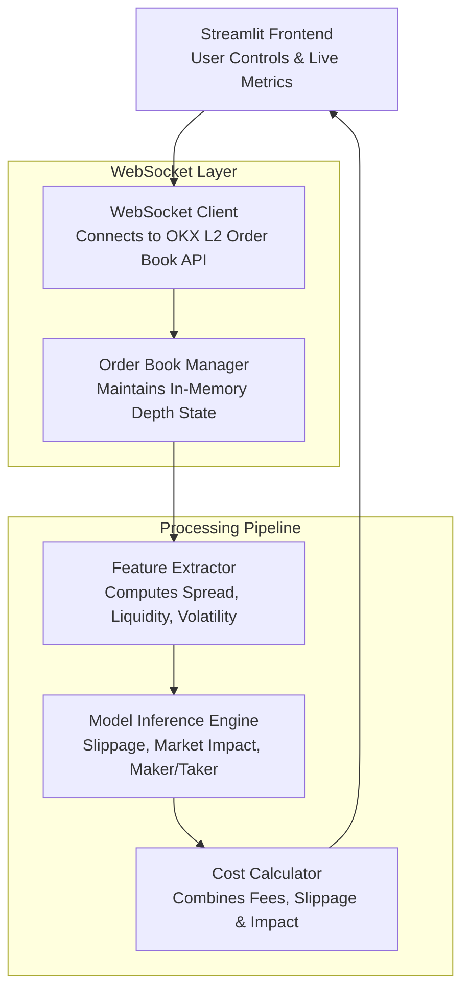

# ⚡ Crypto Trade Simulator

**Real-time trading cost simulator for OKX spot markets — with slippage, fees, market impact, and maker/taker estimation. Built using Streamlit, WebSockets, and ML models.**

---

## 🚀 Features

- ✅ Live order book ingestion from OKX WebSocket API
- 🧠 Real-time inference of:
  - Slippage
  - Fees (VIP-tier aware)
  - Market Impact (Almgren–Chriss)
  - Maker vs Taker Probability
- ⚙️ ML Models: Linear Regression, Random Forest, Logistic Regression
- 📊 Streamlit-based dashboard with latency benchmarking
- ⚡ Sub-20ms processing pipeline per tick

---

## 🧱 Architecture


---
## 📺 Demo
🎥 Video Demo: https://www.loom.com/share/7b4f18db75ff4933af32c11af58b0336?sid=282bfa8a-65b8-465f-a8fa-29dee16eed1c

📄 Full Documentation: https://docs.google.com/document/d/1AGW8MnVVrMVFsOyp2XXrbSjVm4Y845UEaD_SigJ1qUE/edit?usp=sharing

---
## 🧠 Models and Algorithms

### 🔹 Slippage Estimation

**Models Used:**
- `Linear Regression` – for expected slippage
- `Random Forest Quantile Regression` – for tail risk estimation

**Input Features:**
- `Spread` – `(ask - bid) / mid_price`
- `Order Size Ratio` – `order_qty / top_book_liquidity`
- `Volatility` – user-provided or computed from mid-price series

**Model Output:**
- `Expected Slippage (%)`
- `Tail Slippage (95th percentile)`

---

### 🔹 Maker/Taker Classification

**Model Used:**
- `Logistic Regression` – binary classification for maker vs taker

**Input Features:**
- `Relative Price` – order price distance from mid-price
- `Spread`
- `Order Size (USD)`

**Model Output:**
- `Maker Fill Probability` — probability between 0 and 1

**Formula:**

- `P(maker) = σ(α₀ + α₁·x₁ + α₂·x₂ + α₃·x₃)`


  Where `σ(z) = 1 / (1 + e^(-z))` is the sigmoid activation.

---

### 🔹 Market Impact Model (Almgren–Chriss)

This model estimates trading impact as a function of volatility and volume.

**Inputs:**
- `X` – Order size (in asset units)
- `V` – Daily trading volume (in asset units)
- `σ` – Volatility
- `η` – Temporary impact coefficient (tuned offline)

**Formulas:**
- Permanent Impact: `I_perm = σ × (X / V)`
- Temporary Impact: `I_temp = η × sqrt(X / V)`
- Total Market Impact: `I_total = I_perm + I_temp`

---
## ⚙️ Performance Optimizations
- 🔁 Model caching using `st.session_state`

- ⚡ Vectorized NumPy calculations

- 🧵 Async WebSocket reads with `asyncio`

- 🔄 Batched UI updates to minimize rerenders

- 🧠 Efficient data structures (`dict`, `deque`)

---
## 🧪 Latency Benchmarks
| Stage              | Latency (ms) |
| ------------------ | ------------ |
| WebSocket Read     | 1–3          |
| Feature Extraction | 5–10          |
| Model Inference    | 5-10          |
| UI Update          | 2–10        |
| **Total**          | **\~30–40**  |

---
## 🛠️ Installation
```
git clone https://github.com/your-username/trade-app.git
cd trade-app
python3 -m venv venv
source venv/bin/activate
pip install -r requirements.txt
```
---
## ▶️ Run the App
```
# First-time: Train models
python train_models.py
```
```
# Start Streamlit app
streamlit run app.py
```
- Open your browser at http://localhost:8501

---

## References

- Almgren, R., & Chriss, N. (2000). Optimal execution of portfolio transactions. Journal of Risk.
- OKX API Documentation:(https://www.okx.com/docs-v5/en/)
- Diehl, S. (2021). Analysis of Cryptocurrency Slippage.


